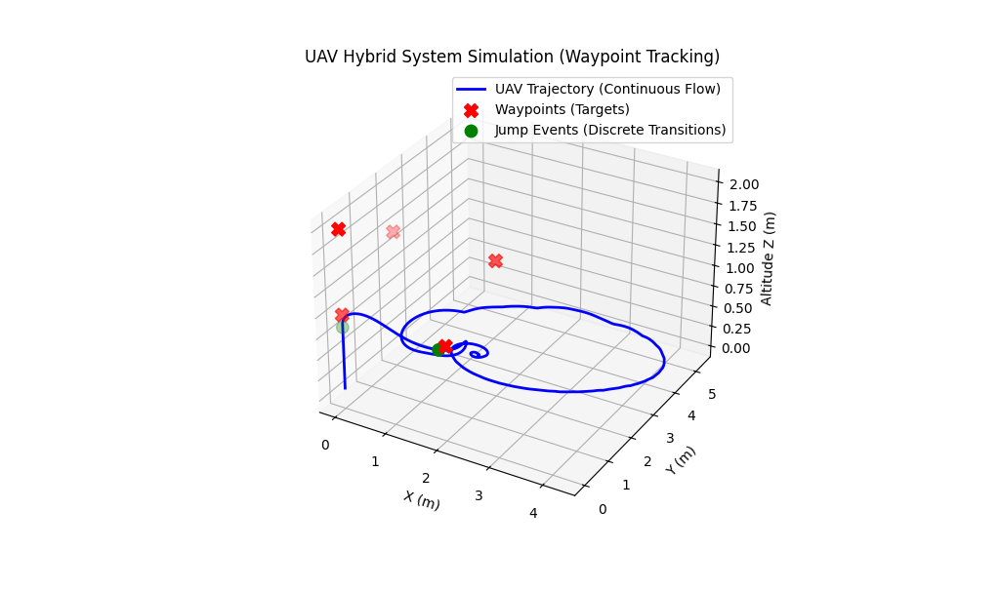

# UAV Sim
Simple Hybrid UAV Simulation

## Using `gym-pybullet-drones`
[gym-pybullet-drones](https://github.com/utiasDSL/gym-pybullet-drones)
### Install
```bash
git clone https://github.com/utiasDSL/gym-pybullet-drones.git
cd gym-pybullet-drones
pip install -e .
# pid example
python gym_pybullet_drones/examples/pid.py
```
### Simulation
#### Case 1: Waypoint Tracking
    
$$
x = \begin{bmatrix} p \\\ v \\\ q \end{bmatrix} \in \mathbb{R}^6 \times \mathcal{Q}
$$

1. State Space
    - Position: $p\in\mathbb{R}^3$
    - Velocity: $v\in\mathbb{R}^3$
    - Index of (currently tracked) Waypoint: $q\in\mathcal{Q}=\{0,1,2,\dots,N\}$
    - Thus, the complete **hybrid state vector $x$** of the system is defined as:
  
  

1. Flow Set $C$

$$
C = \left\lbrace x \in \mathbb{R}^6 \times \mathcal{Q} \mid \lVert p - W_q \rVert \ge \epsilon \lor q = N \right\rbrace
$$

3. Flow Map $f$

$$\dot{x}=f(x)=\begin{bmatrix}v\\\mathcal{F}_{dyn}(p,v,u_{pid}(p,v,W_q))\\\0\end{bmatrix},\quad x\in C$$

4. 

