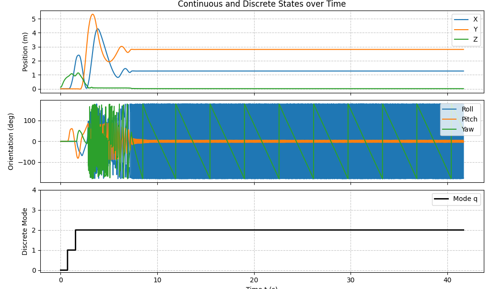
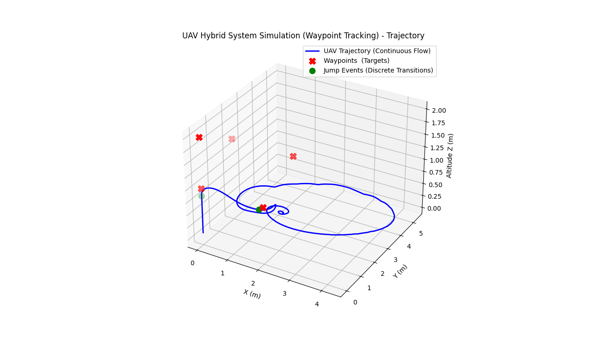
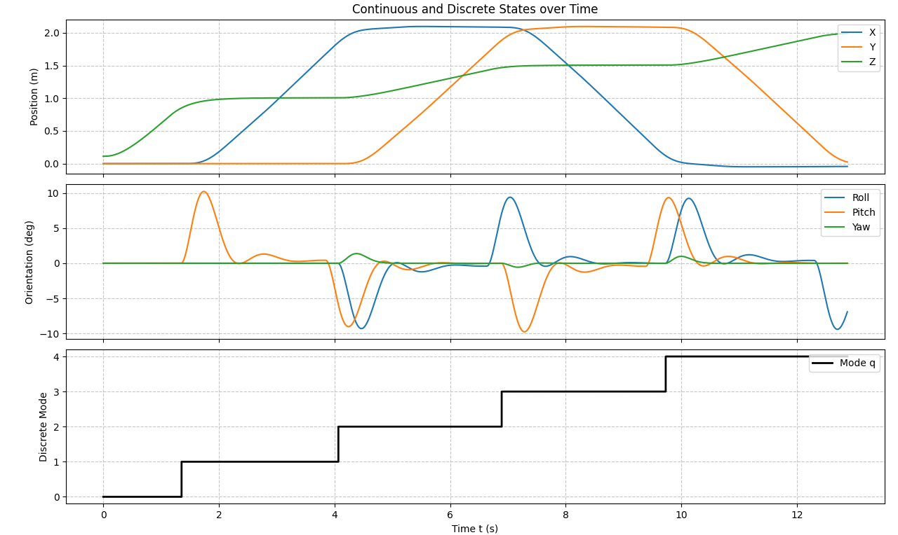
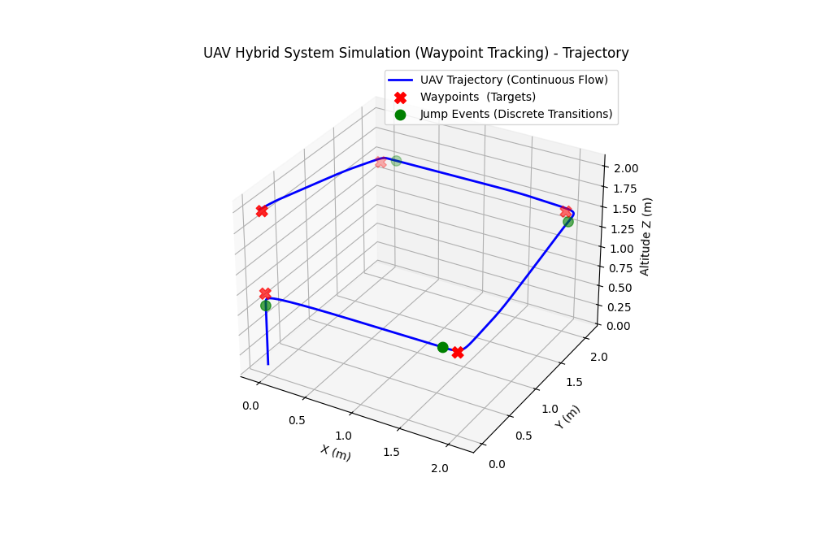
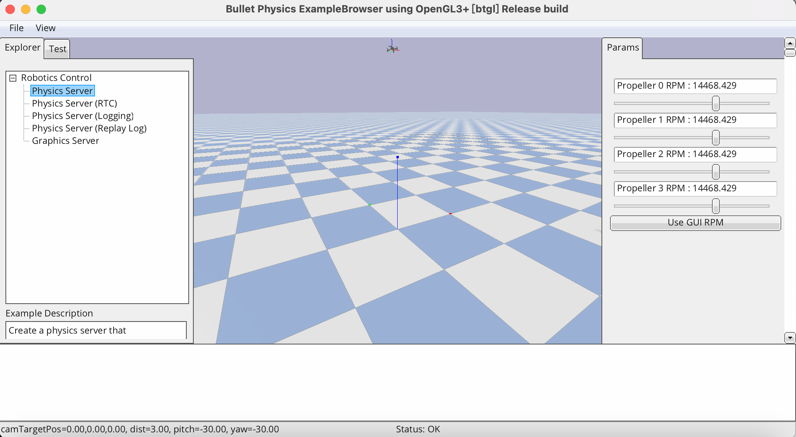

[back](../)
# UAV Sim
Simple Hybrid UAV Simulation

## Using `gym-pybullet-drones`

### Case 1: Waypoint Tracking

PID based UAV simple waypoint tracking task: _square climbing_.

#### Mathematical Model    
1. State Space (in 3D space)
- For _Continuous State_:
    - Position: $p\in\mathbb{R}^3$
    - Velocity: $v\in\mathbb{R}^3$
- For _Discrete State_:
    - Index of Waypoint (Tracking Target): $q\in\mathcal{Q}=\left\lbrace 0,1,2,\dots,N \right\rbrace$
        - Coordinates $W=\left\lbrace W_0,W_1,\dots,W_N \right\rbrace$, where $W_q\in\mathbb{R}^3$ is the coordinate of idx $q$
- Thus, the complete **hybrid state vector $x$** of the system is defined as:
  
$$
x = \begin{bmatrix} p \\\ v \\\ q \end{bmatrix} \in \mathbb{R}^6 \times \mathcal{Q}
$$

2. Flow Set $C$

The flow set determines the conditions under which the system undergoes continuous-time physical evolution:

- As long as the Euclidean distance between the UAV and the current target waypoint $W_q$ is greater than or equal to the tolerance radius $\epsilon$
- or if the system has reached the final waypoint ($q=N$), it maintains continuous flight:

$$
C = \left\lbrace x \in \mathbb{R}^6 \times \mathcal{Q} \mid \lVert p - W_q \rVert \ge \epsilon \lor q = N \right\rbrace
$$

3. Flow Map $f$

$(x_t,a_t) \rightarrow x_{t+1}$

Within the flow set, the evolution of the system follows the **differential equation $\dot{x}=f(x)$**. During this phase:
    
- For continuous state:

$$\dot{p} = v$$

$$\dot{v} = \mathcal{F}_{dyn}(p,v,u_{pid}(p,v,W_q))$$
    
- For discrete state $q$: $\dot{q}=0$ since $q$ is invariant in flow set
- Physical state is governed jointly by the underlying _rigid body dynamics_ and the _closed-loop PID controller_:

$$
\dot{x} = f(x) = \left[ \matrix{ v \\\ \mathcal{F}_{dyn}(p, v, u_{pid}(p, v, W_q)) \\\ 0 } \right], \quad x \in C
$$

Note:
- $u_{pid}$ is the _control command_ with $W_q$ acting as the absolute target
- $\mathcal{F}_{dyn}$ represents the _rigid body dynamics integration_ computed by the underlying _6-DOF physics engine_

4. Jump Set ($D$)

The jump set defines the strict boundary where discrete events (_transients_)  are triggered: 

- When the UAV enters the $\epsilon$-neighborhood of the target waypoint
- and the current waypoint is not the final destination

The state machine triggers a jump:

$$
D = \left\lbrace x \in \mathbb{R}^6 \times \mathcal{Q} \mid \lVert p - W_q \rVert < \epsilon \land q < N \right\rbrace
$$

5. Jump Map ($g$) (_i.e. Transition_)

When the state $x\in D$, the system undergoes a discrete jump $x^+=g(x)$. 

- At this instant, the physical position and velocity remain continuous (**no spatial mutation occurs**)
- but the target waypoint index $q$ advances to the next one:

$$x^+=g(x)=\begin{bmatrix}p\\\v\\\q+1\end{bmatrix},\quad x\in D$$

6. Overall **Hybrid Automaton Equations**

$$\mathcal{H} := \begin{cases}
\dot{x}=f(x),&x\in C \\\ x^+=g(x),&x\in D
\end{cases}$$

#### Simulation Results - Initial Exp
1. State Plot


2. Trajectory


3. Simulation Results Analysis

**Conclusion:** The breakdown of local stability in **underactuated systems** under large step inputs.

**Overview Results Analysis:** As observed in the state and trajectory plots, the UAV successfully tracks the initial waypoints, indicated by the discrete mode transitions ($q = 0 \to 1 \to 2$). However, upon switching to mode $q=2$ (targeting [2.0, 2.0, 1.5]), the large spatial distance introduces a severe step-error to the closed-loop controller. This forces an aggressive attitude adjustment, evident from the violent high-frequency oscillations in the Orientation plot (Roll/Pitch/Yaw) after $t \approx 2s$. The extreme tilt angles cause the vertical thrust component to drop below gravity ($T\cos\theta < mg$), leading to an irreversible altitude loss ($Z \to 0$, as seen in the Position plot). The UAV hits the ground and becomes locked in an unrecoverable physical state, failing to ever enter the $\epsilon$-neighborhood (Jump Set $D$) of the subsequent waypoint. Consequently, the discrete state $q$ permanently stalls at 2.

**Potential Dynamical Properties to Study:** 
- **Stability (Region of Attraction):** The continuous flow map $f(x)$ utilizing standard PID control is only _locally asymptotically stable_ for **the 6-DOF underactuated system**. It exhibits severe instability under large step inputs due to the coupling between attitude and translational dynamics.
- **Attractivity (Reachability):** The target jump set $D_{q+1}$ is not attractive from the post-jump initial state $x(t_0)$ under the current flow map. The continuous trajectory diverges to the ground singularity before intersecting $D$.
- **Robustness:** The current system architecture lacks robustness against actuator saturation (motor RPM limits) and unmodeled ground-effect disturbances when subjected to extreme attitude commands.

**Outline of a Possible Analysis Approach:** 

- **Step 1: Lyapunov-based Stability Analysis:** Construct a Control Lyapunov Function (CLF), denoted as $V(x)$, for the closed-loop continuous dynamics to estimate the **Maximum Region of Attraction (ROA)** regarding the allowable positional tracking error.
- **Step 2: Forward Reachability Verification:** Mathematically verify whether the initial state immediately following a discrete jump, $x^+ = g(x)$, safely resides within the established ROA of the subsequent flow map.
- **Step 3: Trajectory Redesign (Controller Synthesis):** Introduce a sufficiently smooth reference trajectory planner (e.g., a minimum-snap or cubic polynomial interpolator) into $f(x)$. This ensures the instantaneous tracking error remains strictly bounded within the ROA, guaranteeing forward invariance and successful intersection with all subsequent jump sets.

4. Running Logs
```log
pybullet build time: Mar  9 2026 01:33:09
[INFO] BaseAviary.__init__() loaded parameters from the drone's .urdf:
[INFO] m 0.027000, L 0.039700,
[INFO] ixx 0.000014, iyy 0.000014, izz 0.000022,
[INFO] kf 3.160000e-10, km 7.940000e-12,
[INFO] t2w 2.250000, max_speed_kmh 30.000000,
[INFO] gnd_eff_coeff 11.368590, prop_radius 0.023135,
[INFO] drag_xy_coeff 0.000001, drag_z_coeff 0.000001,
[INFO] dw_coeff_1 2267.180000, dw_coeff_2 0.160000, dw_coeff_3 -0.110000
Version = 4.1 INTEL-18.8.16
Vendor = Intel Inc.
Renderer = Intel Iris Pro OpenGL Engine
b3Printf: Selected demo: Physics Server
startThreads creating 1 threads.
starting thread 0
started thread 0 
MotionThreadFunc thread started
viewMatrix (0.6427875757217407, -0.4393851161003113, 0.6275069117546082, 0.0, 0.766044557094574, 0.36868780851364136, -0.5265407562255859, 0.0, -0.0, 0.8191521167755127, 0.5735764503479004, 0.0, 2.384185791015625e-07, -0.0, -5.0, 1.0)
projectionMatrix (0.5263671875, 0.0, 0.0, 0.0, 0.0, 1.0, 0.0, 0.0, 0.0, 0.0, -1.0000200271606445, -1.0, 0.0, 0.0, -0.02000020071864128, 0.0)
/Users/wangxiaonan/miniconda3/envs/drones_py310/lib/python3.10/site-packages/gymnasium/spaces/box.py:236: UserWarning: WARN: Box low's precision lowered by casting to float32, current low.dtype=float64
  gym.logger.warn(
/Users/wangxiaonan/miniconda3/envs/drones_py310/lib/python3.10/site-packages/gymnasium/spaces/box.py:306: UserWarning: WARN: Box high's precision lowered by casting to float32, current high.dtype=float64
  gym.logger.warn(
Physics engine is computing the hybrid system evolution... Please wait.
Jump Triggered! Reached waypoint 0, switching to waypoint 1. Current coordinates: [0.00, 0.00, 0.85]
Jump Triggered! Reached waypoint 1, switching to waypoint 2. Current coordinates: [1.87, -0.00, 0.93]
numActiveThreads = 0
stopping threads
Thread with taskId 0 exiting
Thread TERMINATED
destroy semaphore
semaphore destroyed
destroy main semaphore
main semaphore destroyed
```

#### Simulation Results - Optimization Exp

1. Optimizations

- **Virtual Target Initialization:** Introduced a `virtual_target_pos` state variable initialized exactly at the drone's spawn location:
    - This ensures the **initial control error is zero**,
    - **preventing any violent takeoff maneuvers**.
- **Kinematic Trajectory Generator (Linear Interpolation):** Added a **smooth interpolation mechanism** _inside_ the continuous Flow Map $f(x)$ loop. Instead of instantly switching to the next distant waypoint, the virtual target moves towards the absolute waypoint at a **constrained, constant velocity** (MAX_SPEED = 0.8 m/s). -> Enhance Stability
- **Elimination of Step-Inputs for the Controller:** 
    - Modify the PID controller to track this continuously moving `virtual_target_pos` rather than the absolute `WAYPOINTS[q]`.
    - By breaking down the large spatial gap into millimeter-level, time-stepped increments, we completely eliminated the massive step-errors that previously caused extreme attitude (pitch/roll/yaw) oscillations and the local stability failure of the underactuated system.

2. State Plot


3. Trajectory


4. Sim GUI Display


5. Running Logs
```log
pybullet build time: Mar  9 2026 01:33:09
[INFO] BaseAviary.__init__() loaded parameters from the drone's .urdf:
[INFO] m 0.027000, L 0.039700,
[INFO] ixx 0.000014, iyy 0.000014, izz 0.000022,
[INFO] kf 3.160000e-10, km 7.940000e-12,
[INFO] t2w 2.250000, max_speed_kmh 30.000000,
[INFO] gnd_eff_coeff 11.368590, prop_radius 0.023135,
[INFO] drag_xy_coeff 0.000001, drag_z_coeff 0.000001,
[INFO] dw_coeff_1 2267.180000, dw_coeff_2 0.160000, dw_coeff_3 -0.110000
Version = 4.1 INTEL-18.8.16
Vendor = Intel Inc.
Renderer = Intel Iris Pro OpenGL Engine
b3Printf: Selected demo: Physics Server
startThreads creating 1 threads.
starting thread 0
started thread 0 
MotionThreadFunc thread started
viewMatrix (0.6427875757217407, -0.4393851161003113, 0.6275069117546082, 0.0, 0.766044557094574, 0.36868780851364136, -0.5265407562255859, 0.0, -0.0, 0.8191521167755127, 0.5735764503479004, 0.0, 2.384185791015625e-07, -0.0, -5.0, 1.0)
projectionMatrix (0.6816405653953552, 0.0, 0.0, 0.0, 0.0, 1.0, 0.0, 0.0, 0.0, 0.0, -1.0000200271606445, -1.0, 0.0, 0.0, -0.02000020071864128, 0.0)
/Users/wangxiaonan/miniconda3/envs/drones_py310/lib/python3.10/site-packages/gymnasium/spaces/box.py:236: UserWarning: WARN: Box low's precision lowered by casting to float32, current low.dtype=float64
  gym.logger.warn(
/Users/wangxiaonan/miniconda3/envs/drones_py310/lib/python3.10/site-packages/gymnasium/spaces/box.py:306: UserWarning: WARN: Box high's precision lowered by casting to float32, current high.dtype=float64
  gym.logger.warn(
Physics engine is computing the hybrid system evolution... Please wait.
Jump Triggered! Reached waypoint 0, switching to waypoint 1. Current coordinates: [0.00, 0.00, 0.85]
Jump Triggered! Reached waypoint 1, switching to waypoint 2. Current coordinates: [1.85, -0.00, 1.01]
Jump Triggered! Reached waypoint 2, switching to waypoint 3. Current coordinates: [2.09, 1.88, 1.47]
Jump Triggered! Reached waypoint 3, switching to waypoint 4. Current coordinates: [0.12, 2.09, 1.51]
All waypoints tracked successfully.
numActiveThreads = 0
stopping threads
Thread with taskId 0 exiting
Thread TERMINATED
destroy semaphore
semaphore destroyed
destroy main semaphore
main semaphore destroyed
```
