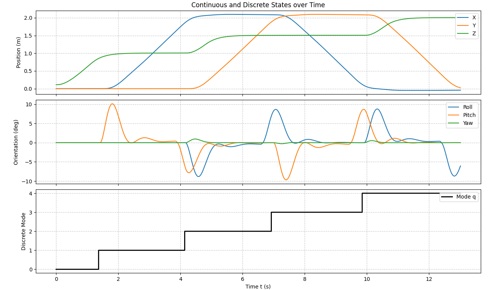
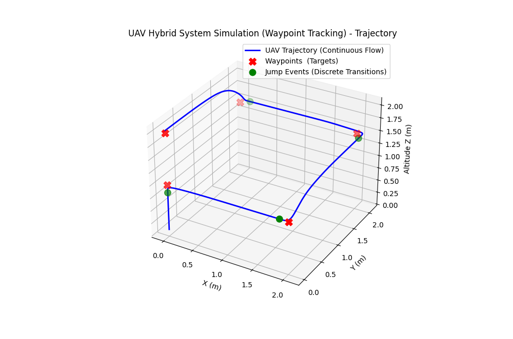
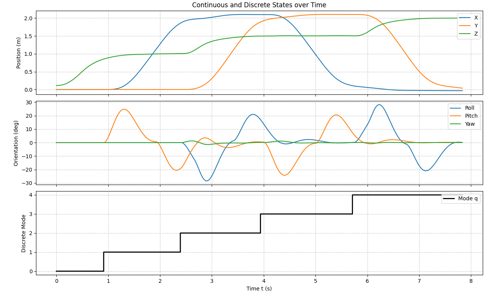
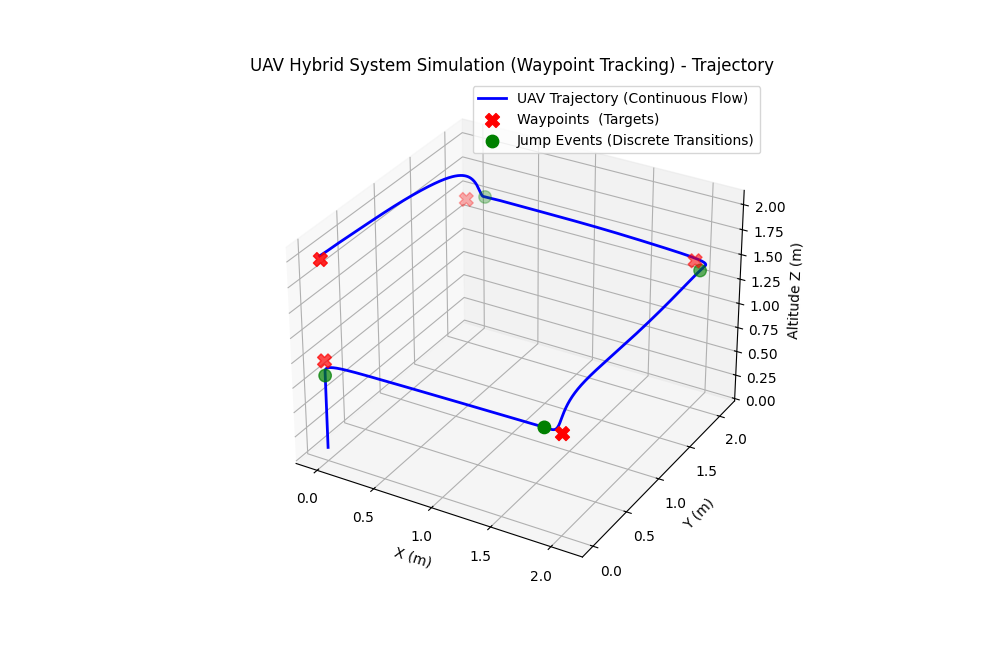

#### To be complete
- faster due to `Eigen`

# UAV Sim
Simple Hybrid UAV Simulation

## Using `gym-pybullet-drones`

### Case 1: Waypoint Tracking - MPC

MPC (Model Predictive Control) based UAV simple waypoint tracking task: _square climbing_.

#### Mathematical Mode

#### Simulation Results

[uav_waypoint_tracking_mpc.py](uav_waypoint_tracking_mpc.py)

1. State Plot

2. Trajectory

[uav_waypoint_tracking_mpc_pylib.py](uav_waypoint_tracking_mpc_pylib.py)

1. State Plot

2. Trajectory
